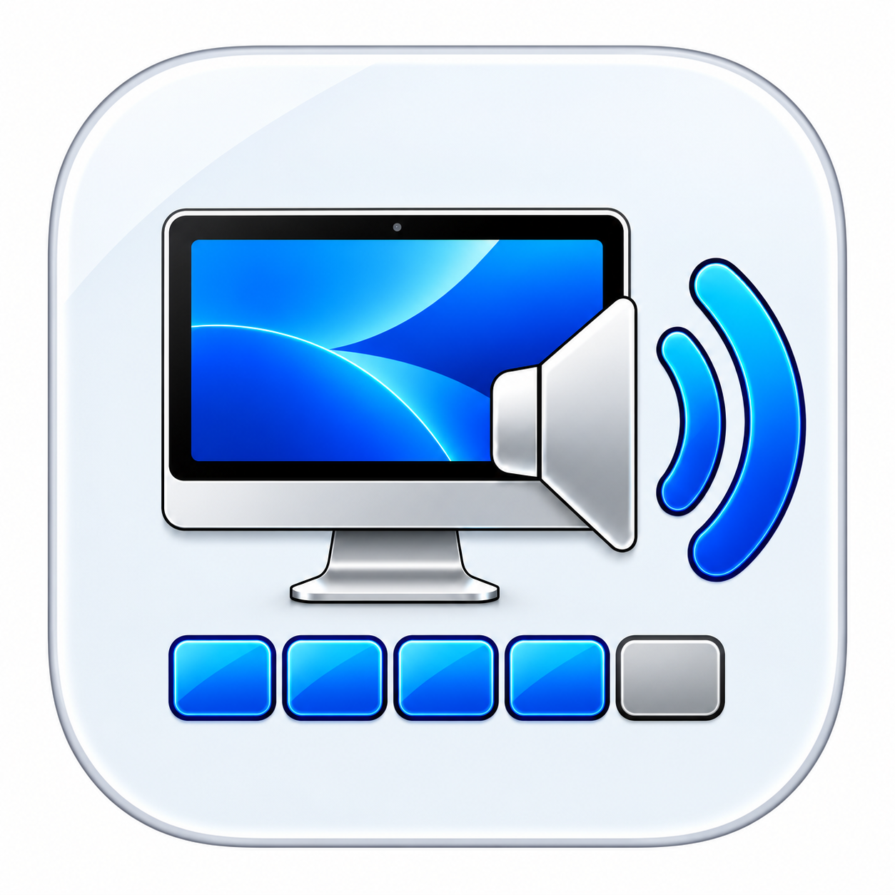
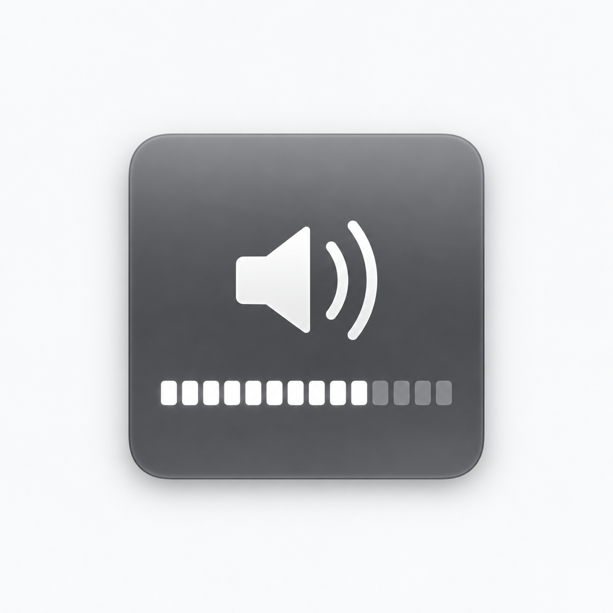
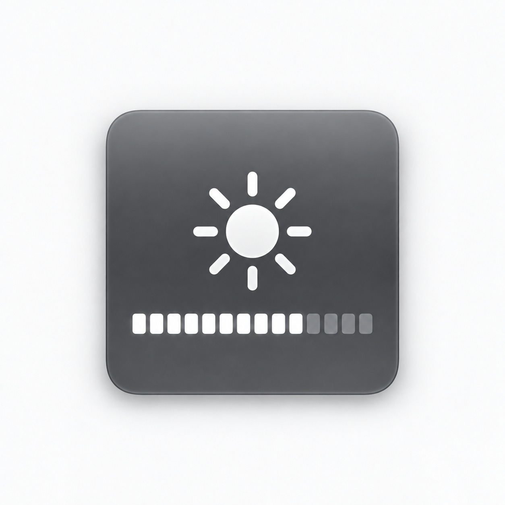
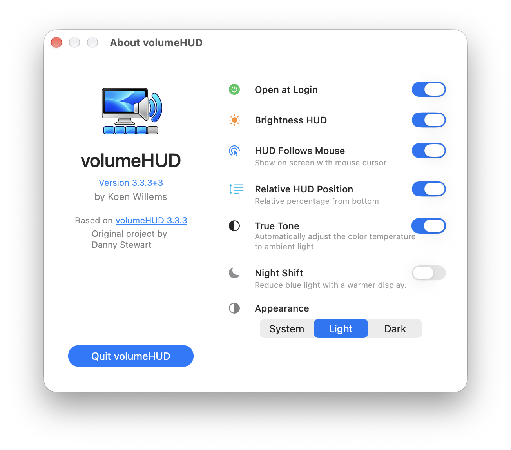
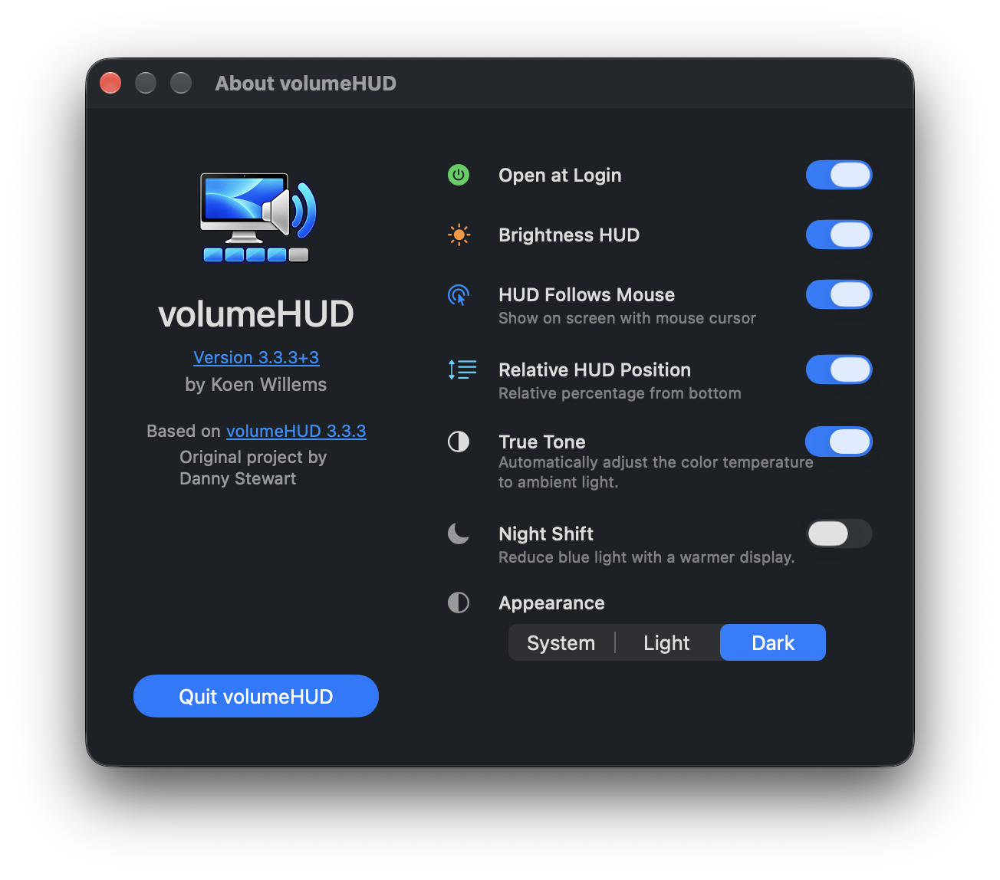

<p align="center">
  
</p>

<h1 align="center">volumeHUD — Studio Display Custom Fork</h1>

<p align="center">
  A custom fork of volumeHUD for Apple Studio Display volume and brightness HUD support.
</p>

This is a custom fork of [volumeHUD](https://github.com/dannystewart/volumeHUD), based on version 3.3.3.

I started working on this fork because I wanted to bring back the familiar macOS-style HUD when changing volume and display brightness on an Apple Studio Display connected to a MacBook Pro.

The goal is to keep volumeHUD simple while making it work well with this setup, including controls from a Stream Deck.

## Why this fork exists

On my setup, the Apple Studio Display is connected to a MacBook Pro and its built-in speakers are used as the default audio output.

macOS no longer always shows the familiar on-screen HUD in the way I wanted when controlling volume and brightness, especially when those controls are triggered from a Stream Deck.

This fork extends volumeHUD so that:

- volume changes can show the familiar HUD;
- mute and unmute can show the familiar HUD;
- Apple Studio Display brightness can be controlled;
- brightness changes can show a matching HUD;
- HUD placement can follow the display containing the mouse pointer;
- the application can be controlled conveniently from the menu bar;
- True Tone can be controlled from the application;
- the project can be built from the command line without requiring a full Xcode installation.

## Volume and Brightness HUDs

The application provides a macOS-style HUD for both volume and display brightness.

### Volume HUD



The Volume HUD appears when changing the system volume or when muting or unmuting the audio output.

### Brightness HUD



The Brightness HUD appears when changing the brightness of a supported display, such as an Apple Studio Display.

## Added in this fork

Compared with the original volumeHUD project, this fork adds or extends support for:

- Apple Studio Display brightness control;
- Brightness HUD;
- Stream Deck volume, mute and brightness controls;
- HUD Follows Mouse;
- menu bar controls;
- True Tone controls;
- command-line building.

The intention is not to turn volumeHUD into a general display-management application. The focus is specifically on restoring convenient controls and a familiar HUD experience.

## Settings

The application includes settings for configuring its behaviour.

### Light appearance



### Dark appearance



## Behaviour overview

### Volume

volumeHUD can display its own volume HUD when the system volume changes.

This is useful when the Apple Studio Display speakers are used as the current audio output and volume is controlled from devices such as a Stream Deck.

### Mute

Muting and unmuting the audio output can also trigger the volume HUD.

### Brightness

This fork adds brightness control for the Apple Studio Display.

Brightness can be changed using controls such as Stream Deck multimedia actions while volumeHUD provides the corresponding Brightness HUD.

Brightness behaviour may depend on the display preset selected in macOS. Normal brightness adjustment is intended primarily for display modes in which macOS allows brightness to be changed.

### HUD Follows Mouse

When enabled, the HUD is shown on the display that currently contains the mouse pointer.

This is particularly useful with a MacBook Pro connected to an external Studio Display.

## My setup

This fork was developed and tested primarily with:

- MacBook Pro;
- Apple Studio Display;
- Apple Studio Display speakers as the default audio output;
- Stream Deck for volume, mute and brightness controls.

Other configurations may work, but this is the setup the changes in this fork are designed around.

## Building

The project can be built from the command line using:

```bash
tools/build_volumehud_cli.sh
```

The build script is intended to work with Apple's Command Line Tools and does not require a full Xcode installation.

## Project structure

Some relevant parts of the repository are:

```text
volumeHUD/
├── images/
│   ├── brightness-hud.png
│   ├── settings_dark.png
│   ├── settings_light.png
│   └── volume-hud.png
├── resources/
│   └── volumeHUD.png
├── tools/
│   └── build_volumehud_cli.sh
└── ...
```

## Design philosophy

The original volumeHUD is a small and focused utility, and this fork tries to preserve that character.

The additional functionality is deliberately centred around a specific use case: a MacBook Pro with an Apple Studio Display where the familiar volume and brightness HUDs are desirable, including when those controls are triggered externally.

## Upstream project

This project is based on the original volumeHUD by Danny Stewart:

https://github.com/dannystewart/volumeHUD

The original project remains the foundation of this fork.

## License

See the license information included with the original volumeHUD project and this repository.
